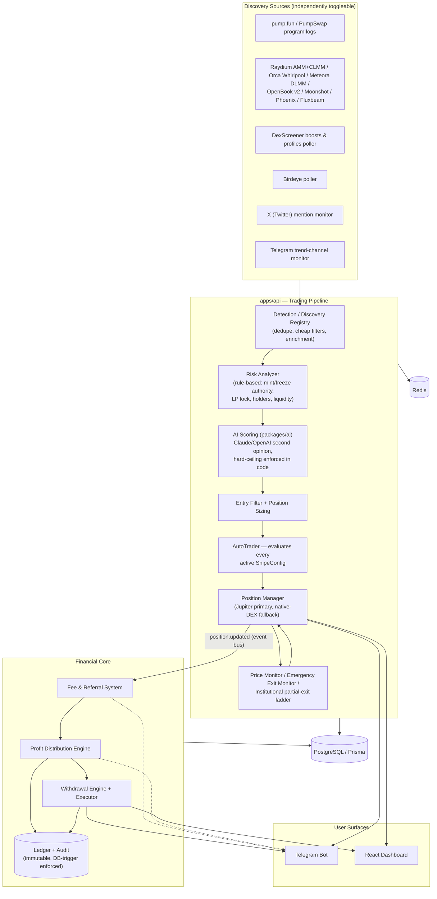
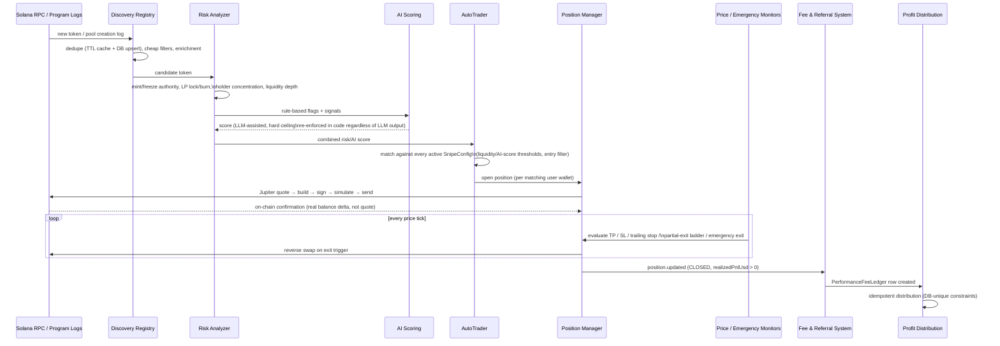
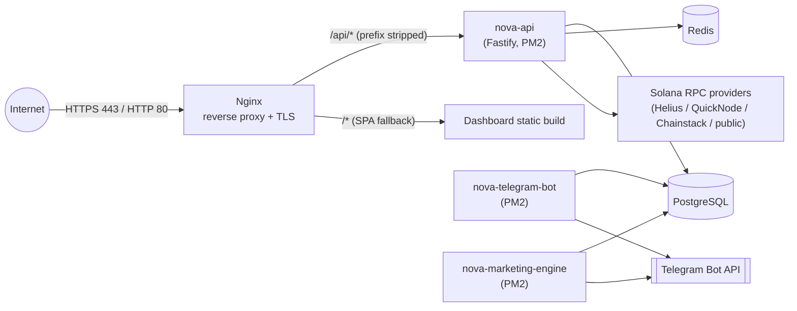

# Architecture

This document describes the system design of Nova Solana AI Sniper as it
exists in this repository today. For a shorter, code-organization-focused
version see `docs/ARCHITECTURE.md`; this document is the investor/engineering
-facing overview.

## 1. Monorepo layout

```
apps/
  api/               Fastify backend — detection, risk engine, AI scoring,
                      trading engine, financial core, REST + WebSocket API
  telegram-bot/       User-facing bot (grammy): trading alerts, wallet,
                      referrals, withdrawals, admin controls
  marketing-engine/   AI-generated content scheduler for a marketing bot feed
  dashboard/          React/Vite SPA
packages/
  shared/             Env validation, logger, domain types, financial
                      primitives (withdrawal engine, ledger, referral,
                      portfolio math) shared between apps/api and
                      apps/telegram-bot
  ai/                 Claude/OpenAI provider abstraction + deterministic +
                      LLM-assisted risk scoring
docker/               Dockerfiles, nginx config
docs/                 This documentation set
```

`packages/shared` exists specifically so the withdrawal engine, ledger
writer, and referral logic are called by **both** `apps/api`'s HTTP routes
and `apps/telegram-bot`'s slash commands against the exact same functions
and the same Prisma client — never two independent reimplementations of a
financial workflow.

## 2. High-level component diagram



## 3. Data flow: token discovery → automated buy → exit



## 4. apps/api internals

| Directory                           | Responsibility                                                                                                                                                                                                                            |
| ----------------------------------- | ----------------------------------------------------------------------------------------------------------------------------------------------------------------------------------------------------------------------------------------- |
| `solana/`                           | RPC connection management (with failover across configured providers), Jupiter swap client, Jito bundle sender, per-DEX native executors, price oracles                                                                                   |
| `detection/`                        | Turns raw on-chain events into semantic signals (new launches, migrations, whale activity); rule-based risk analyzer                                                                                                                      |
| `discovery/`                        | Multi-source discovery registry: adapters, pollers, cheap pre-filters, enrichment, dedupe                                                                                                                                                 |
| `social/`                           | Twitter mention monitor, Telegram trend-channel monitor                                                                                                                                                                                   |
| `trading/`                          | Exit engine (pure function, unit-testable, shared by live trading and backtesting), Position Manager, AutoTrader, entry filter, position sizing, adaptive/institutional trailing stops, Emergency Exit Monitor, copy trading, backtesting |
| `business/`                         | Performance fee & referral system, Profit Distribution Engine                                                                                                                                                                             |
| `wallet/`                           | Deposit monitor, withdrawal execution monitor                                                                                                                                                                                             |
| `security/` (via `packages/shared`) | AES-256-GCM at-rest key encryption, scrypt password hashing                                                                                                                                                                               |
| `routes/`                           | REST API surface — see `API.md`                                                                                                                                                                                                           |
| `worker.ts`                         | Wires detection → risk → AI → auto-trader → monitors into a background pipeline started alongside the HTTP server                                                                                                                         |

## 5. Concurrency & data-integrity design

Every path that moves money or changes a financial record's state is
designed around one rule: **a check-then-act read followed by a separate
write is never trusted alone** — it is always backed by either an atomic
conditional `UPDATE`, a `SELECT ... FOR UPDATE` row lock inside a
transaction, or a database-level unique constraint that makes a duplicate
write physically impossible, not just unlikely.

| Path                                              | Guard                                                                                                                                                     |
| ------------------------------------------------- | --------------------------------------------------------------------------------------------------------------------------------------------------------- |
| Position close (TP/SL/trailing/emergency/partial) | `PositionCloseLock` — DB-unique claim table (`position_close_claims`) + in-process mutex + stale-claim auto-recovery                                      |
| Duplicate open position                           | Postgres partial unique index: at most one `OPEN` position per `(walletId, tokenId)`                                                                      |
| Withdrawal request                                | Atomic conditional balance-reservation `UPDATE`, partial unique index (one active request per user), optional idempotency key                             |
| Withdrawal status transition                      | `SELECT ... FOR UPDATE` row lock inside a transaction                                                                                                     |
| Withdrawal execution signature                    | Guarded single-write column — a second write attempt throws instead of silently overwriting                                                               |
| Profit distribution                               | Unique constraint on `(positionId)` / `(performanceFeeLedgerId)` — fast-path event and reconciliation sweep can safely race                               |
| Referral reward grant                             | Unique constraint on `referrerUserId` in a dedicated `referral_reward_grants` table — two simultaneous qualifying referrals can never both grant a reward |

## 6. apps/telegram-bot

A single `grammy` bot instance serving three logical surfaces: trading/exit
alerts, an inline-keyboard-driven user experience (wallet, snipe/exit-
strategy configuration, referrals, withdrawals, profit/earnings dashboards),
and an admin control surface. Shares `packages/shared`'s withdrawal/ledger/
referral logic directly with `apps/api` — never a second implementation.

## 7. apps/marketing-engine

Generates category-rotated marketing posts (news, trading tips, market
updates, trending tokens, referral pushes, announcements) via the shared AI
provider, deduplicates by content hash, and schedules a small number of
random-time posts per day, publishing through the Telegram bot.

## 8. apps/dashboard

A React/Vite SPA. REST polling on a fixed interval, plus a `/ws` WebSocket
event push (`token.created` / `trade.created` / `position.updated`) from an
in-process event bus so pages refresh immediately rather than waiting out
the poll interval. JWT is passed as a `?token=` query param on the WebSocket
handshake (browsers cannot set custom headers on a WS upgrade request); REST
polling remains as a resilience fallback if the socket drops.

## 9. Database

PostgreSQL via Prisma. Every migration is a plain, reviewable SQL file (no
destructive migrations are auto-generated without review). Key model
groups: `User` / `Wallet` / `Token` / `Trade` / `Position` /
`PositionPartialExit` / `EmergencyExitLog` / `SnipeConfig`; the financial
core: `LedgerEntry` / `AuditLog` / `PerformanceFeeLedger` / `ReferralReward`
/ `ProfitDistribution` / `UserDistributionBalance` / `OwnerBalance` /
`PlatformBalance` / `WithdrawalRequest` / `WithdrawalSettings` /
`BusinessSettings` / `ReferralLevelConfig`; and the concurrency-guard tables
`position_close_claims` / `referral_reward_grants`.

`LedgerEntry` and `AuditLog` are made genuinely immutable by a Postgres
`BEFORE UPDATE/DELETE` trigger — not merely an application-level
convention — since a table owner always bypasses `GRANT`/`REVOKE`
restrictions on their own tables in Postgres.

## 10. Deployment topology



Two supported deployment paths:

- **Bare-metal / VPS** — `ecosystem.config.cjs`, PM2 supervises `nova-api`,
  `nova-telegram-bot`, `nova-marketing-engine` directly, with automatic
  restart, a memory cap, and backoff on crash-looping.
- **Docker Compose** — `docker-compose.yml` runs Postgres, Redis, a one-shot
  migration job, the three Node services, and an Nginx + certbot pair, each
  with `restart: unless-stopped` and a healthcheck (PM2 is not run a second
  time inside containers).

See `INSTALL.md` for step-by-step setup of either path.

## 11. Security posture summary

See `SECURITY.md` for the complete, audited posture. Summary: private keys
encrypted at rest (AES-256-GCM), decrypted only in-memory for a single sign
operation; scrypt + `timingSafeEqual` password handling; JWT auth with
tiered rate limiting; Zod validation on every input; ownership checks on
every user-scoped route; an immutable, trigger-enforced ledger/audit trail;
and a firewalled, Nginx-fronted network topology — the API and dashboard dev
server are never directly internet-reachable.
