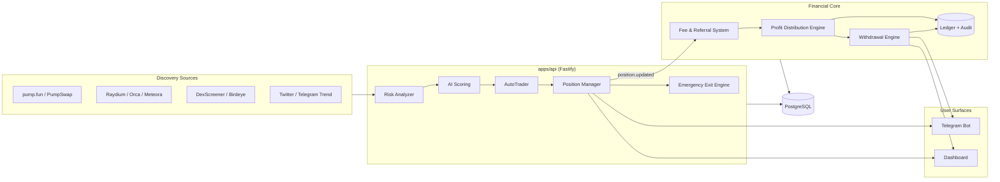

# Nova Solana AI Sniper

**An AI-powered, institutional-grade Solana trading platform** — real-time token
launch detection across multiple discovery sources, on-chain risk analysis,
LLM-assisted scoring, automated buy/sell execution across multiple DEXes,
an internal custodial wallet system with an immutable ledger, profit
distribution, a multi-level referral program, a reviewed withdrawal engine,
a Telegram bot suite, and a React dashboard.

[](<>)
[](<>)
[](./LICENSE)

Persian version: [README_FA.md](./README_FA.md)

---

## Table of Contents

- [Project Overview](#project-overview)
- [Features](#features)
- [Architecture](#architecture)
- [Technology Stack](#technology-stack)
- [Installation](#installation)
- [Configuration](#configuration)
- [Running](#running)
- [Environment Variables](#environment-variables)
- [API](#api)
- [Dashboard](#dashboard)
- [Telegram Bot](#telegram-bot)
- [Wallet](#wallet)
- [Referral](#referral)
- [Profit Distribution](#profit-distribution)
- [Withdrawals](#withdrawals)
- [Security](#security)
- [Testing](#testing)
- [FAQ](#faq)
- [License](#license)

---

## Project Overview

Nova Solana AI Sniper detects newly launched and trending Solana tokens
across several independent discovery sources, scores each one with a
deterministic rule-based risk engine plus an optional LLM second opinion,
and — when a token clears every safety gate — executes an automated buy on
behalf of every user whose sniper configuration matches. Open positions are
monitored continuously for take-profit, stop-loss, trailing-stop, emergency
exit, and (in Institutional Mode) a partial-exit profit ladder. Every trade,
deposit, withdrawal, profit share, and referral reward is written to an
immutable ledger and audit trail. Users interact through a Telegram bot or a
web dashboard; funds live in per-user, individually encrypted custodial
wallets — there is no pooled treasury.

Competing feature set target: BullX, Photon, Maestro, Banana Gun, Trojan,
BonkBot.

## Features

- **Multi-source discovery** — pump.fun / PumpSwap / Raydium (AMM + CLMM) /
  Orca Whirlpool / Meteora DLMM / OpenBook v2 / Moonshot / Phoenix / Fluxbeam
  on-chain program-log subscriptions, plus DexScreener boosted/profile
  pollers, a Birdeye poller, an X (Twitter) mention monitor, and a Telegram
  trend-channel monitor — each independently enable/disable-able.
- **Two-layer risk & AI scoring** — a deterministic, pure rule-based scoring
  engine (mint/freeze authority, LP lock/burn, holder concentration,
  liquidity depth, honeypot heuristics) that runs unconditionally, plus an
  optional Claude/OpenAI second opinion whose score can only ever be
  _capped down_ by the deterministic hard ceiling, never overridden upward.
- **Automated execution** — Jupiter aggregator as the primary route, with a
  native per-DEX fallback executor when Jupiter can't route a swap; every
  fill is verified against the real on-chain balance delta, never trusted
  from a quote alone.
- **Exit strategies** — fixed take-profit/stop-loss, an adaptive trailing
  stop, an Institutional Mode profit ladder (partial exits at configurable
  gain tiers with a protected "moonbag" reserve), and an Emergency Exit
  Engine that force-liquidates on rug/dump signals (liquidity pulled,
  authorities re-enabled, developer-wallet dumping) independent of price.
- **Internal wallet & immutable ledger** — every user gets an individually
  encrypted (AES-256-GCM) Solana wallet; every balance-affecting event
  (deposit, withdrawal, profit credit, platform fee, referral reward) is
  recorded as an immutable `LedgerEntry` + `AuditLog` pair, enforced
  immutable at the database level by a trigger, not just application logic.
- **Profit distribution** — a performance-fee system splits realized profit
  between the trader, the platform, and the referral chain, with a
  reconciliation sweep that guarantees eventual consistency even across a
  process crash or missed event.
- **Multi-level referral program** — up to a configurable depth, with
  automatic reward activation once a referrer crosses a threshold, and a
  full referral leaderboard.
- **Reviewed withdrawal engine** — a request → risk-score → admin review →
  approve → on-chain execution → reconciliation pipeline with duplicate-
  request protection, daily/min/max limits, and crash-safe execution
  checkpoints.
- **Telegram bot suite** — trading alerts, wallet management, snipe
  configuration, referral/earnings dashboards, withdrawal requests, and an
  admin control surface (kill switch, pause/resume, fee/referral settings).
- **Web dashboard** — live positions, portfolio analytics, wallet and
  transaction history, referral and profit-distribution views, withdrawal
  requests and an admin approval queue, a PnL leaderboard, and a live token
  feed — updated by REST polling plus a WebSocket event push.

## Architecture

See [ARCHITECTURE.md](./ARCHITECTURE.md) for the full system design,
component responsibilities, and data-flow diagrams.



## Technology Stack

| Layer              | Technology                                                                                |
| ------------------ | ----------------------------------------------------------------------------------------- |
| Language           | TypeScript 5.7 (strict), Node.js >= 20                                                    |
| Backend API        | Fastify 5, `@fastify/jwt`, `@fastify/rate-limit`, `@fastify/helmet`, `@fastify/websocket` |
| Database           | PostgreSQL, Prisma ORM 5                                                                  |
| Cache / queues     | Redis (`ioredis`)                                                                         |
| Blockchain         | `@solana/web3.js`, `@solana/spl-token`, Jupiter aggregator API, Jito block engine         |
| AI                 | Anthropic Claude SDK, OpenAI SDK — pluggable provider abstraction                         |
| Telegram           | `grammy`                                                                                  |
| Dashboard          | React 18, Vite 6, React Router, Tailwind CSS                                              |
| Testing            | Vitest (997 tests across the monorepo)                                                    |
| Process management | PM2 (bare-metal) or Docker Compose                                                        |
| Reverse proxy      | Nginx + Let's Encrypt (certbot)                                                           |
| Monorepo           | npm workspaces                                                                            |

## Installation

See [INSTALL.md](./INSTALL.md) for full setup instructions (local
development, Docker Compose, and bare-metal/PM2 production deployment).

Quick start:

```bash
npm install
cp .env.example .env   # fill in secrets — see Environment Variables below
npm run prisma:migrate
npm run dev:api
```

## Configuration

All configuration is environment-variable driven (`packages/shared/src/env.ts`
is the single source of truth, validated with `zod` at boot). See
`.env.example` for the full, documented list. Only `DATABASE_URL`,
`REDIS_URL`, `JWT_SECRET`, and `ENCRYPTION_KEY` are required to boot the API
— every other integration (Solana RPC providers, Helius, Jito, Anthropic/
OpenAI, Telegram, Twitter, Birdeye) is optional and the affected feature
disables itself with a warning log rather than crashing the process.

## Running

```bash
npm run dev:api          # Fastify API + background trading/discovery workers
npm run dev:bot           # Telegram bot
npm run dev:marketing     # AI marketing content engine
npm run dev:dashboard     # React dashboard (Vite dev server)

npm run build              # build every workspace
npm run test                # run the full test suite (Vitest)
npm run lint / lint:fix
npm run typecheck
```

Production process supervision is via PM2 (`ecosystem.config.cjs`) on
bare-metal/VPS deployments, or Docker Compose's own `restart: unless-stopped`

- healthchecks in the containerized path — see INSTALL.md for both.

## Environment Variables

Full reference: `.env.example`. Grouped summary:

| Group             | Examples                                                                                                                                                                                                              |
| ----------------- | --------------------------------------------------------------------------------------------------------------------------------------------------------------------------------------------------------------------- |
| Core infra        | `DATABASE_URL`, `REDIS_URL`, `API_PORT`, `API_HOST`, `CORS_ORIGIN`                                                                                                                                                    |
| Safety switches   | `LIVE_TRADING`, `KILL_SWITCH`, `MAX_TRADE_SOL`, `MAX_DAILY_LOSS_USD`, `MAX_OPEN_POSITIONS`, `MIN_WALLET_RESERVE_SOL`                                                                                                  |
| Secrets           | `JWT_SECRET`, `ENCRYPTION_KEY`                                                                                                                                                                                        |
| Solana RPC        | `SOLANA_RPC_URL`, `SOLANA_WS_URL`, `HELIUS_API_KEY`, `QUICKNODE_RPC_URL`, `CHAINSTACK_RPC_URL`, `JITO_BLOCK_ENGINE_URL`                                                                                               |
| AI                | `ANTHROPIC_API_KEY`, `OPENAI_API_KEY`                                                                                                                                                                                 |
| Discovery sources | `RAYDIUM_CLMM_SOURCE_ENABLED`, `OPENBOOK_SOURCE_ENABLED`, `MOONSHOT_SOURCE_ENABLED`, `PHOENIX_SOURCE_ENABLED`, `LIFINITY_SOURCE_ENABLED`, `FLUXBEAM_SOURCE_ENABLED`, `DEXSCREENER_*`, `BIRDEYE_*`, `TELEGRAM_TREND_*` |
| Telegram          | `TELEGRAM_BOT_TOKEN`, `TELEGRAM_CHAT_ID`                                                                                                                                                                              |
| Withdrawals       | `WITHDRAWAL_EXECUTION_ENABLED`, `WITHDRAWAL_EXECUTION_INTERVAL_MS`                                                                                                                                                    |
| Deposits          | `DEPOSIT_MONITOR_ENABLED`, `DEPOSIT_MONITOR_INTERVAL_MS`                                                                                                                                                              |

**Never commit `.env`.** Wallet private keys are encrypted at rest
(AES-256-GCM) using `ENCRYPTION_KEY` and are never logged or returned by the
API in plaintext.

## API

Full reference: [API.md](./API.md). REST, JWT-bearer authenticated, JSON
in/out, Zod-validated request bodies, tiered rate limiting. Route groups:
auth, tokens, trades, positions, snipe configs, copy-trade configs, wallets
(including backup/restore/transaction history), portfolio, referrals, profit
distribution, withdrawals (user + admin), discovery stats, health/metrics,
and a `/ws` WebSocket event push.

## Dashboard

React/Vite SPA served behind Nginx. Pages: Overview, Tokens, Positions,
Portfolio, Wallets (+ per-wallet detail), Referral, Profit Distribution,
Withdrawals (+ an admin approval queue), Snipe Configs, Leaderboard, Logs,
and Login. Polls REST endpoints on a fixed interval and additionally
subscribes to a `/ws` event feed so pages refresh immediately on
`token.created` / `trade.created` / `position.updated` instead of waiting
out the poll interval.

## Telegram Bot

Built on `grammy`. User-facing commands include `/start`, `/withdraw`,
`/withdrawals`, `/withdrawstatus`, `/profits`, `/earnings`, `/fees`,
`/distribution`, plus extensive inline-keyboard screens for wallet
management, snipe/exit-strategy configuration, live position monitoring, and
referrals. Admin-only commands: `/status`, `/stats`, `/pauseall`,
`/resumeall`, `/killswitch`, `/setfee`, `/setreferral`,
`/setreferraldepth`, `/togglereferral`, `/businessreport`. Every
privileged/money command resolves identity from Telegram's own verified
`from.id` — never a client-supplied user id.

## Wallet

Every user is issued an individually generated Solana wallet (BIP39
mnemonic, standard derivation path). The private key is AES-256-GCM
encrypted at rest with a key derived (via scrypt) from `ENCRYPTION_KEY`; a
decrypted keypair only ever exists in memory for the duration of a single
sign operation and is never logged, cached, or returned by any API response.
There is **no pooled treasury wallet anywhere in this codebase** — trading
and withdrawals always move funds directly into/out of the user's own
wallet. Balances are tracked via a deposit monitor plus a manual
refresh-balance endpoint, both funneling through one shared, race-safe
balance-reconciliation helper.

## Referral

Every user gets a unique referral code at registration. A referral chain is
resolved by walking `referredByCode` links up to a configurable maximum
depth, with cycle protection. When a trade closes profitably, the
performance fee is split across the referral chain per a configurable
per-level percentage. Referring 3 users unlocks an automatic default sniper
configuration for the referrer, granted exactly once via a database-unique
constraint that makes concurrent duplicate-grant races impossible.

## Profit Distribution

An event-driven engine (fast-path event subscriber + a periodic
reconciliation sweep, so it's eventually consistent even across a crash)
turns each closed, profitable position's already-computed performance-fee
ledger row into a permanent `ProfitDistribution` record and atomically
updates running balances for the trader, each referrer, the platform, and
the owner — fully idempotent via database-unique constraints, so the fast
path and the reconciliation sweep can never double-credit the same close.

## Withdrawals

Request → automatic risk scoring → (optional) admin review → approval → real
on-chain SOL transfer → reconciliation. Protections include: an atomic
conditional-update balance reservation (never read-then-write), a database
partial-unique-index limiting a user to one active request at a time,
optional client idempotency keys, `SELECT ... FOR UPDATE` row locking on
every status transition, and a crash-safety checkpoint that durably records
a transaction signature the instant it's broadcast — before confirmation is
even awaited — so a process crash mid-transfer can never leave an untracked
payment.

## Security

Full reference: [SECURITY.md](./SECURITY.md). Highlights: AES-256-GCM
at-rest key encryption, scrypt password hashing with `timingSafeEqual`
comparison, JWT auth with tiered rate limiting, Zod validation on every
input, ownership checks on every user-scoped route, an immutable
(trigger-enforced) ledger/audit trail, and a documented, reviewed list of
accepted `npm audit` findings rather than a blind force-fix.

## Testing

```bash
npm run test        # Vitest — 997 tests across every workspace
npm run typecheck    # tsc --noEmit, every workspace
npm run lint          # ESLint, zero errors
```

Coverage includes dedicated concurrency/race-condition simulations for the
position-close path, the withdrawal engine, and the referral-reward grant
path — not just happy-path assertions.

## FAQ

See [FAQ.md](./FAQ.md).

## License

Proprietary — All Rights Reserved. See [LICENSE](./LICENSE).
