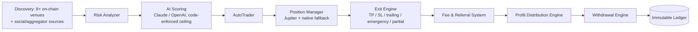

# Nova Solana AI Sniper — Whitepaper

_Persian version: [WHITEPAPER_FA.md](./WHITEPAPER_FA.md)_

## 1. Vision

Automated on-chain trading has, until now, forced a choice between speed and
safety: the fastest sniper bots execute blind, and the safest ones execute
too late to matter. Nova Solana AI Sniper's vision is a platform where a
token is discovered, analyzed, and — if and only if it clears a layered
safety gate — traded, all within the window that makes early entry
meaningful, with every dollar of profit and every withdrawal accounted for
in an immutable, auditable ledger from the first block.

## 2. Mission

To give individual traders institutional-grade infrastructure — multi-source
discovery, layered risk analysis, AI-assisted scoring, disciplined exit
management, and transparent, race-condition-hardened fund custody — without
requiring them to run their own infrastructure, write their own risk models,
or trust a pooled custodial wallet with their capital.

## 3. Architecture

Nova is a TypeScript monorepo split into independently deployable services
sharing two internal packages (`packages/shared`, `packages/ai`) so that
financial logic — the withdrawal engine, the ledger writer, referral
resolution — is implemented exactly once and called identically from both
the REST API and the Telegram bot, never reimplemented twice with the risk
of the two copies drifting apart.

See `ARCHITECTURE.md` for the full component breakdown and data-flow
diagrams.

## 4. Technology

- **Language & runtime:** TypeScript (strict mode) on Node.js >= 20,
  throughout every service.
- **API layer:** Fastify 5 with JWT auth, tiered rate limiting, Zod request
  validation, and Helmet security headers.
- **Persistence:** PostgreSQL via Prisma, with every schema change a
  reviewed, plain-SQL migration — never an unreviewed auto-migration.
- **Blockchain integration:** `@solana/web3.js`, the Jupiter aggregator API
  for primary swap routing, Jito for bundle submission, and direct RPC
  subscriptions (with multi-provider failover) to pump.fun, PumpSwap,
  Raydium (AMM + CLMM), Orca Whirlpool, Meteora DLMM, OpenBook v2, Moonshot,
  Phoenix, and Fluxbeam program logs.
- **AI:** a pluggable provider abstraction over the Anthropic Claude and
  OpenAI SDKs, used for a bounded, timeout-protected second opinion on top
  of a deterministic scoring engine that runs independent of any AI
  availability.

## 5. AI

Every discovered token is scored twice. First, a pure, deterministic
scoring engine evaluates seven categories — safety (mint/freeze authority,
LP lock/burn), liquidity depth and confidence, holder distribution,
momentum, volume authenticity, developer risk, and wallet-cluster analysis —
and computes a hard disqualification ceiling from real on-chain signals.
Second, an optional LLM call (Claude or OpenAI) provides a qualitative
second opinion and a human-readable summary. The LLM's numeric score is
re-clamped in code against the deterministic ceiling regardless of what the
model returns — the AI can make the platform more cautious, never less. A
provider failure, timeout (bounded at 15 seconds), or malformed response
fails closed to a score of 0, never an optimistic default, and never blocks
the rest of the discovery pipeline for other tokens.

## 6. Trading

Positions are opened via the Jupiter aggregator (with a native execution
fallback per venue, currently implemented for PumpSwap) and every fill is
verified against the real on-chain balance delta — never trusted from a
pre-trade quote. Exit management supports fixed take-profit/stop-loss, an
adaptive trailing stop, an Institutional Mode partial-exit profit ladder
with a protected "moonbag" reserve, and an Emergency Exit Engine that
force-liquidates independent of price on rug/dump signals (liquidity
pulled, mint/freeze authority re-enabled, developer-wallet dumping). Every
close path — regardless of which trigger fired it — is serialized through a
single, database-backed mutual-exclusion mechanism, eliminating the
double-sell race class of bug entirely.

## 7. Security

Wallet private keys are individually encrypted at rest (AES-256-GCM,
scrypt-derived key) and decrypted only in memory for the duration of a
single signing operation. There is no pooled treasury wallet. Authentication
uses JWT with tiered rate limiting; passwords are hashed with scrypt and
compared with a timing-safe comparison. Every user-scoped route enforces
ownership server-side. The ledger and audit trail are made immutable by a
database trigger, not merely an application convention. Full detail:
`SECURITY.md`.

## 8. Infrastructure

Two supported production paths — Docker Compose (with Postgres, Redis, the
three Node services, and an Nginx + certbot pair) and bare-metal/PM2 — both
fronted by an Nginx reverse proxy terminating TLS, with the application's
raw ports firewalled from direct internet access. Process supervision
restarts a crashed service automatically with backoff; a documented
post-deployment checklist (`INSTALL.md`) verifies the running build actually
matches the current source before trusting it in production.

## 9. Wallet

Every user receives an individually generated Solana wallet (a fresh BIP39
mnemonic, standard derivation path) the moment they need one — never a
shared address. Deposits are detected by a polling monitor and reconciled
through one shared, race-safe balance-refresh path also used by the
on-demand refresh endpoint and the Telegram bot's refresh button, so the
three can never disagree about what counts as a deposit.

## 10. Referral

Each user receives a unique referral code at registration. A referral chain
is resolved by walking `referredByCode` links to a configurable maximum
depth, with cycle protection against any malformed or adversarial chain.
When a referred user's position closes profitably, a configurable
percentage of the platform's performance fee is shared with each referrer
in the chain. Reaching a threshold of direct referrals unlocks a one-time
reward (a default sniper configuration), granted exactly once via a
database-unique constraint that makes a duplicate grant physically
impossible even under concurrent qualifying signups.

## 11. Profit Distribution

An event-driven engine turns each closed, profitable position's
already-computed performance-fee ledger row into a permanent
`ProfitDistribution` record and atomically updates running balances for the
trader, each referrer, the platform, and the owner. A fast-path event
subscriber handles the common case immediately; a periodic reconciliation
sweep guarantees eventual completeness regardless of event ordering, process
restarts, or a fast-path timeout — the two are idempotent against each
other via database-unique constraints, so neither can double-credit a
close.

## 12. Roadmap

See `ROADMAP.md` for the complete, current list. Highlights: native
execution fallbacks for the remaining DEX venues beyond PumpSwap, native
liquidity readers for Moonshot and Phoenix, formal load testing at defined
concurrency targets, and horizontal scaling of the API tier (the existing
concurrency guards are already designed to hold across process boundaries,
not just within one Node process).

## 13. Future Expansion

Multi-chain support, an institutional/API-key access tier for programmatic
integration beyond Telegram and the dashboard, and expanded portfolio
analytics building on the existing Sharpe-like ratio, drawdown, and
profit-factor computations already shipped in the platform today.
