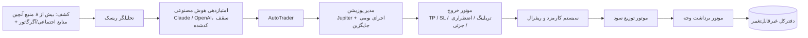

# وایت‌پیپر Nova Solana AI Sniper

_نسخه انگلیسی: [WHITEPAPER_EN.md](./WHITEPAPER_EN.md)_

## ۱. چشم‌انداز (Vision)

معامله‌گری خودکار آنچین تا امروز ما را بین سرعت و امنیت مجبور به انتخاب
می‌کرد: سریع‌ترین ربات‌های اسنایپ کورکورانه معامله می‌کنند و امن‌ترین‌ها
آن‌قدر دیر عمل می‌کنند که ورود زودهنگام دیگر معنایی ندارد. چشم‌انداز
Nova Solana AI Sniper ساخت پلتفرمی است که در آن یک توکن کشف، تحلیل و —
فقط در صورت عبور از یک لایه‌بندی کامل از گیت‌های ایمنی — معامله می‌شود؛
همه این‌ها در همان بازه زمانی که ورود زودهنگام را معنادار می‌کند، در حالی
که هر دلار سود و هر برداشت وجه از همان بلاک اول در یک دفترکل
(ledger) غیرقابل‌تغییر و قابل‌ممیزی ثبت می‌شود.

## ۲. مأموریت (Mission)

هدف ما دادن زیرساخت درجه نهادی (institutional-grade) به معامله‌گران
فردی است — کشف چندمنبعی، تحلیل ریسک لایه‌ای، امتیازدهی به‌کمک هوش
مصنوعی، مدیریت خروج منظم، و نگهداری شفاف و مقاوم در برابر شرایط رقابتی
(race condition) وجوه — بدون این‌که لازم باشد کاربران زیرساخت خودشان را
اجرا کنند، مدل ریسک خودشان را بنویسند، یا به یک کیف‌پول متمرکز و استخری
اعتماد کنند.

## ۳. معماری (Architecture)

Nova یک مونوریپوی TypeScript است که به سرویس‌های مستقل قابل‌استقرار
تقسیم شده و دو پکیج داخلی مشترک (`packages/shared`, `packages/ai`) دارد؛
به این ترتیب منطق مالی — موتور برداشت وجه، نویسنده دفترکل، و منطق تشخیص
زنجیره ریفرال — دقیقاً یک‌بار پیاده‌سازی می‌شود و از REST API و ربات
تلگرام به‌طور یکسان فراخوانی می‌شود، بدون خطر واگرایی دو نسخه پیاده‌سازی
جداگانه.

برای شرح کامل اجزا و نمودارهای جریان داده، به `ARCHITECTURE.md` مراجعه
کنید.

## ۴. فناوری (Technology)

- **زبان و رانتایم:** TypeScript (حالت strict) روی Node.js نسخه ۲۰ به
  بالا، در تمام سرویس‌ها.
- **لایه API:** Fastify نسخه ۵ با احراز هویت JWT، محدودسازی نرخ درخواست
  چندلایه، اعتبارسنجی درخواست با Zod، و هدرهای امنیتی Helmet.
- **پایگاه‌داده:** PostgreSQL از طریق Prisma؛ هر تغییر اسکیما یک مایگریشن
  SQL بازبینی‌شده است — هرگز مایگریشن خودکار بدون بازبینی.
- **یکپارچگی بلاکچین:** `@solana/web3.js`، Jupiter aggregator API برای
  مسیریابی اصلی سواپ، Jito برای ارسال بسته تراکنش (bundle)، و اشتراک
  مستقیم RPC (با failover چندارائه‌دهنده) به لاگ‌های برنامه‌های pump.fun،
  PumpSwap، Raydium (AMM و CLMM)، Orca Whirlpool، Meteora DLMM، OpenBook
  v2، Moonshot، Phoenix و Fluxbeam.
- **هوش مصنوعی:** یک لایه انتزاعی قابل‌جایگزینی روی SDKهای Anthropic
  Claude و OpenAI، برای دریافت نظر دومِ محدود و دارای تایم‌اوت، مکمل یک
  موتور امتیازدهی قطعی که مستقل از در دسترس بودن هوش مصنوعی اجرا می‌شود.

## ۵. هوش مصنوعی (AI)

هر توکن کشف‌شده دوبار امتیازدهی می‌شود. ابتدا یک موتور امتیازدهی کاملاً
قطعی (deterministic) هفت دسته را ارزیابی می‌کند — ایمنی (اختیار mint و
freeze، قفل/سوزاندن نقدینگی)، عمق و اطمینان نقدینگی، پراکندگی هولدرها،
مومنتوم، اصالت حجم معاملات، ریسک توسعه‌دهنده، و تحلیل خوشه کیف‌پول‌ها —
و یک سقف رد صلاحیت قطعی را از سیگنال‌های واقعی آنچین محاسبه می‌کند. سپس
یک فراخوانی اختیاری LLM (Claude یا OpenAI) نظر کیفی دوم و خلاصه‌ای
قابل‌فهم برای انسان ارائه می‌دهد. امتیاز عددی LLM صرف‌نظر از خروجی مدل،
در کد نسبت به سقف قطعی مجدداً محدود می‌شود — هوش مصنوعی فقط می‌تواند
پلتفرم را محتاط‌تر کند، هرگز کم‌احتیاطتر. خطای ارائه‌دهنده، تایم‌اوت
(حداکثر ۱۵ ثانیه)، یا پاسخ نامعتبر، به‌صورت safe-fail به امتیاز صفر ختم
می‌شود، هرگز یک مقدار پیش‌فرض خوش‌بینانه، و هرگز خط لوله کشف را برای
سایر توکن‌ها مسدود نمی‌کند.

## ۶. معاملات (Trading)

پوزیشن‌ها از طریق Jupiter aggregator باز می‌شوند (با یک اجرای بومی
جایگزین برای هر پلتفرم، که در حال حاضر برای PumpSwap پیاده‌سازی شده)، و
هر پرشدگی (fill) در برابر تغییر واقعی موجودی آنچین تأیید می‌شود — هرگز
صرفاً بر اساس نقل‌قول (quote) پیش از معامله. مدیریت خروج شامل
take-profit/stop-loss ثابت، یک تریلینگ استاپ تطبیقی، نردبان خروج جزئی
«حالت نهادی» (Institutional Mode) با یک ذخیره محافظت‌شده «moonbag»، و
موتور خروج اضطراری است که مستقل از قیمت، بر اساس سیگنال‌های راگ/دامپ
(خروج نقدینگی، فعال‌سازی مجدد اختیار mint/freeze، دامپ کیف‌پول
توسعه‌دهنده) نقدشوندگی اجباری انجام می‌دهد. هر مسیر بستن پوزیشن — صرف‌نظر
از این‌که چه محرکی آن را فعال کرده — از طریق یک مکانیزم واحد
مانع‌همروندی (mutual exclusion) مبتنی بر پایگاه‌داده سریالایز می‌شود، که
کل رده باگ فروش دوگانه (double-sell) را کاملاً حذف می‌کند.

## ۷. امنیت (Security)

کلیدهای خصوصی کیف‌پول به‌صورت جداگانه در حالت سکون (at rest) رمزنگاری
می‌شوند (AES-256-GCM، کلید مشتق‌شده با scrypt) و فقط برای مدت یک عملیات
امضا در حافظه رمزگشایی می‌شوند. هیچ کیف‌پول خزانه‌داری استخری وجود ندارد.
احراز هویت از JWT با محدودسازی نرخ چندلایه استفاده می‌کند؛ رمزهای عبور
با scrypt هش شده و با مقایسه مقاوم در برابر حمله زمان‌سنجی (timing-safe)
بررسی می‌شوند. هر مسیر مختص کاربر، مالکیت را در سمت سرور اجرا می‌کند.
دفترکل و مسیر ممیزی توسط یک تریگر پایگاه‌داده غیرقابل‌تغییر شده‌اند، نه
صرفاً یک قرارداد سطح برنامه. جزئیات کامل: `SECURITY.md`.

## ۸. زیرساخت (Infrastructure)

دو مسیر تولید پشتیبانی‌شده — Docker Compose (با Postgres، Redis، سه
سرویس Node، و یک جفت Nginx + certbot) و بدون‌داکر/PM2 — که هر دو پشت یک
پراکسی معکوس Nginx با پایان‌دهی TLS قرار دارند و پورت‌های خام برنامه از
دسترسی مستقیم اینترنت فایروال شده‌اند. مدیریت پردازه‌ها سرویس‌های
کرش‌کرده را با backoff به‌طور خودکار ری‌استارت می‌کند؛ یک چک‌لیست پس از
استقرار مستندشده (`INSTALL.md`) پیش از اعتماد به یک استقرار در تولید،
تطابق واقعی بیلد در حال اجرا با سورس فعلی را تأیید می‌کند.

## ۹. کیف‌پول (Wallet)

هر کاربر به‌محض نیاز، یک کیف‌پول سولانا به‌طور جداگانه تولید می‌شود
(mnemonic تازه BIP39، مسیر اشتقاق استاندارد) — هرگز یک آدرس مشترک.
واریزها توسط یک مانیتور نظرسنجی (polling) شناسایی و از طریق یک مسیر
یکپارچه و ایمن در برابر شرایط رقابتی برای به‌روزرسانی موجودی تطبیق داده
می‌شوند؛ همین مسیر توسط اندپوینت به‌روزرسانی دستی و دکمه بروزرسانی ربات
تلگرام نیز استفاده می‌شود، بنابراین این سه هرگز نمی‌توانند در مورد آنچه
واریز محسوب می‌شود اختلاف داشته باشند.

## ۱۰. سیستم ریفرال (Referral)

هر کاربر در ثبت‌نام یک کد ریفرال منحصربه‌فرد دریافت می‌کند. زنجیره
ریفرال با دنبال‌کردن پیوندهای `referredByCode` تا یک عمق حداکثری
قابل‌تنظیم، همراه با محافظت در برابر حلقه (cycle protection) در برابر
هر زنجیره نامعتبر یا خصمانه، حل می‌شود. هنگامی که پوزیشن یک کاربر
معرفی‌شده با سود بسته می‌شود، درصدی قابل‌تنظیم از کارمزد عملکرد پلتفرم با
هر معرف در زنجیره به اشتراک گذاشته می‌شود. رسیدن به آستانه‌ای از معرفی‌های
مستقیم، یک پاداش یک‌باره (یک پیکربندی اسنایپ پیش‌فرض) را برای معرف باز
می‌کند که دقیقاً یک‌بار، از طریق یک محدودیت یکتای پایگاه‌داده که حتی تحت
ثبت‌نام‌های همزمان واجد شرایط، اعطای تکراری را از نظر فیزیکی غیرممکن
می‌کند، اعطا می‌شود.

## ۱۱. توزیع سود (Profit Distribution)

یک موتور رویدادمحور، هر ردیف دفترکل کارمزد عملکرد از پیش محاسبه‌شده مربوط
به یک پوزیشن بسته‌شده سودآور را به یک رکورد دائمی `ProfitDistribution`
تبدیل می‌کند و به‌طور اتمی موجودی‌های در حال اجرا برای معامله‌گر، هر
معرف، پلتفرم، و مالک را به‌روزرسانی می‌کند. یک مشترک رویداد مسیر سریع،
حالت رایج را بلافاصله مدیریت می‌کند؛ یک جاروب تطبیق دوره‌ای، کامل‌بودن
نهایی را صرف‌نظر از ترتیب رویدادها، ری‌استارت پردازه، یا تایم‌اوت مسیر
سریع تضمین می‌کند — این دو از طریق محدودیت‌های یکتای پایگاه‌داده نسبت به
یکدیگر ایدمپوتنت هستند، بنابراین هیچ‌کدام نمی‌توانند یک بسته‌شدن را
دوبار اعتبار دهند.

## ۱۲. نقشه راه (Roadmap)

برای فهرست کامل و به‌روز، به `ROADMAP.md` مراجعه کنید. نکات برجسته:
اجرای بومی جایگزین برای سایر پلتفرم‌های DEX فراتر از PumpSwap، خوانشگرهای
نقدینگی بومی برای Moonshot و Phoenix، تست بار رسمی در اهداف همروندی
تعریف‌شده، و مقیاس‌پذیری افقی لایه API (محافظ‌های همروندی موجود از قبل
طوری طراحی شده‌اند که در سطح چند پردازه نیز پابرجا بمانند، نه فقط درون
یک پردازه Node).

## ۱۳. توسعه آینده (Future Expansion)

پشتیبانی چندزنجیره‌ای (multi-chain)، یک لایه دسترسی نهادی/API-key برای
یکپارچه‌سازی برنامه‌نویسی فراتر از تلگرام و داشبورد، و تحلیل پرتفوی
گسترش‌یافته مبتنی بر محاسبات نسبت شبه‌شارپ، افت سرمایه (drawdown)، و
ضریب سود که هم‌اکنون در پلتفرم پیاده‌سازی شده‌اند.
