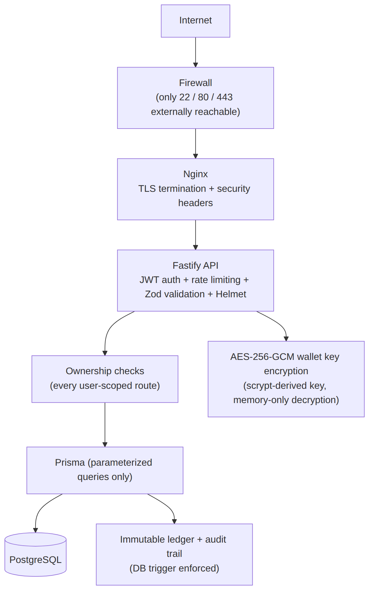
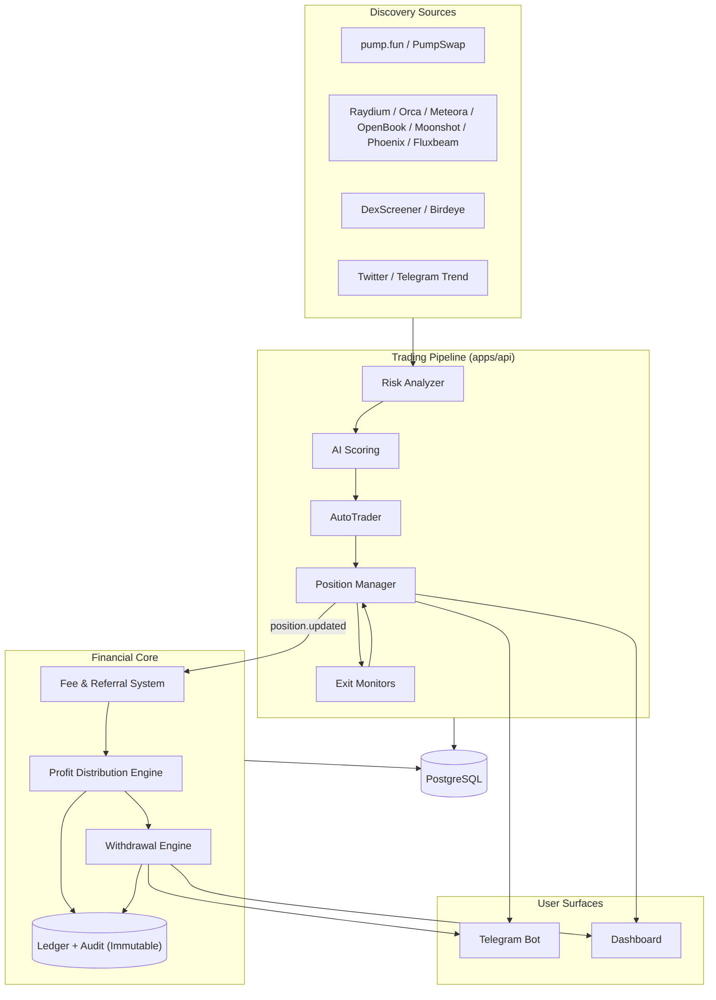
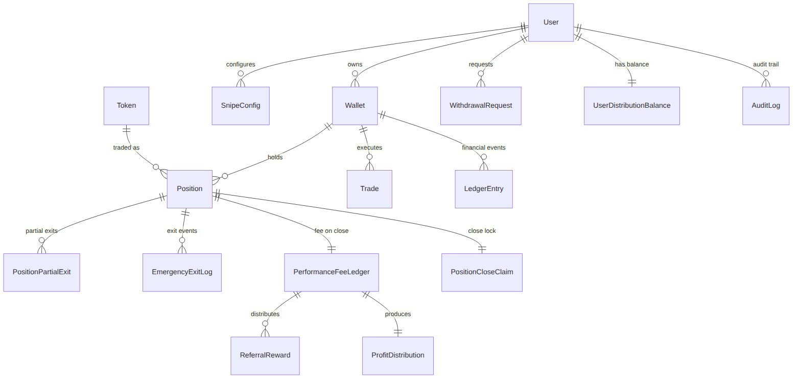
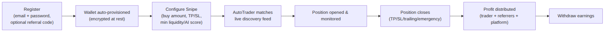
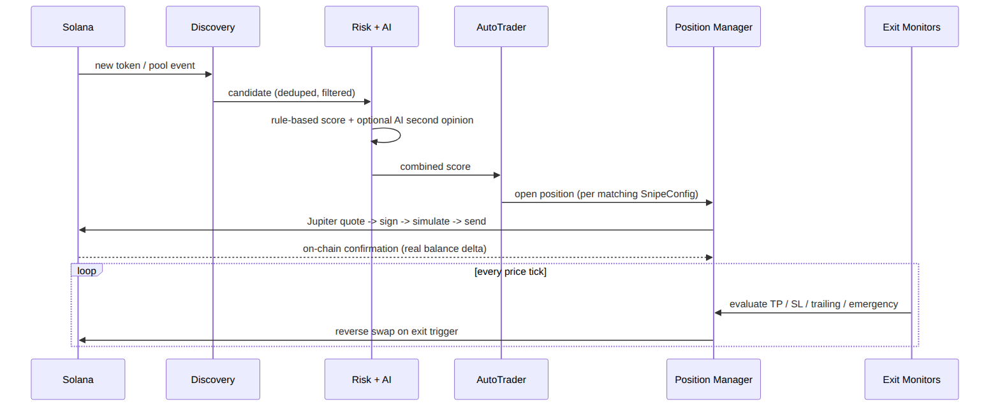
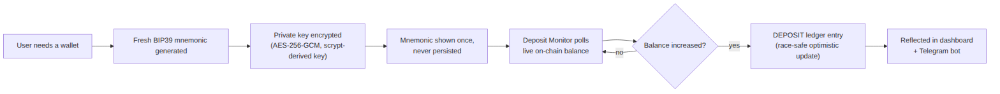
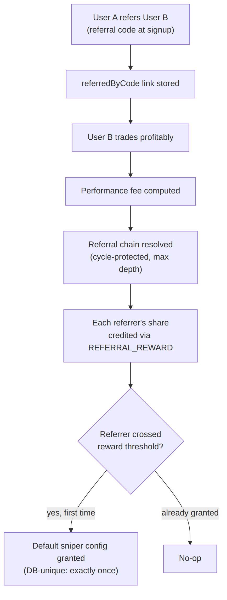
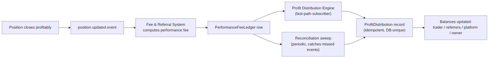
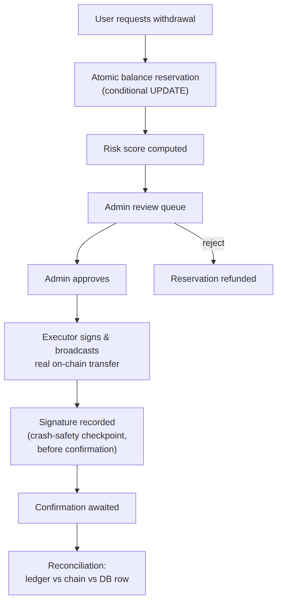
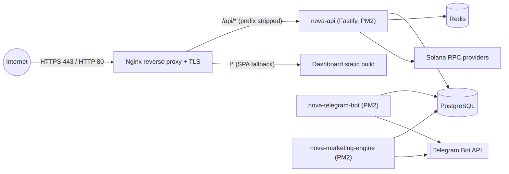

# Nova Solana AI Sniper

### AI-Powered, Institutional-Grade Solana Trading Platform

Investor & Technical Presentation

---

## 1. Project Introduction

- An automated Solana trading platform: discovery, risk analysis, AI
  scoring, execution, exit management, custody, and payouts — end to end.
- Built as a TypeScript monorepo, 997 automated tests, production-hardened.
- Users interact via a **Telegram bot** or a **web dashboard**; funds live
  in **individually encrypted, non-pooled** wallets.
- Competitive target: BullX, Photon, Maestro, Banana Gun, Trojan, BonkBot.

---

## 2. Market Problem

- Solana token launches move in **seconds**, not minutes.
- Manual trading cannot evaluate rug/honeypot risk fast enough to act in
  time — by the time a human checks mint authority and liquidity, the
  window is gone.
- Existing "sniper bots" are largely **speed-only**: they execute blind,
  with no layered risk gating, and often no transparent, auditable fund
  custody.
- Retail traders lack institutional-grade infrastructure: multi-source
  discovery, disciplined exit management, and a real ledger.

---

## 3. Solution

- **Layered, automated risk gating** before every trade — deterministic
  rules first, AI second opinion second, never the reverse.
- **Multi-venue discovery** so no single source's blind spot is the
  platform's blind spot.
- **Disciplined, multi-mode exit management** — not just take-profit, but
  trailing stops, a profit ladder, and a price-independent emergency exit.
- **Transparent custody** — individually encrypted wallets, an immutable
  ledger, and a reviewed withdrawal pipeline.

---

## 4. Platform Overview

| Component        | Role                                                      |
| ---------------- | --------------------------------------------------------- |
| Discovery        | 8+ on-chain venues + social/aggregator sources            |
| Risk + AI Engine | Deterministic scoring + optional LLM second opinion       |
| Execution Engine | Jupiter aggregator + native per-DEX fallback              |
| Financial Core   | Ledger, fees, referrals, profit distribution, withdrawals |
| Surfaces         | Telegram bot, React dashboard                             |

---

## 5. AI Discovery Engine

- Independently toggleable sources: **pump.fun, PumpSwap, Raydium (AMM +
  CLMM), Orca Whirlpool, Meteora DLMM, OpenBook v2, Moonshot, Phoenix,
  Fluxbeam** program-log subscriptions.
- Plus **DexScreener** (boosted + profile pollers), **Birdeye**, an
  **X (Twitter)** mention monitor, and a **Telegram trend-channel** monitor.
- Layered deduplication (per-source TTL cache + a database-level upsert)
  so the same token is never processed twice.
- A source failure is caught and logged **per source** — one integration
  going down never stops the others.

---

## 6. AI Scoring

- Every token is scored **twice**:
  1. A deterministic rule-based engine (always runs) — mint/freeze
     authority, LP lock/burn, holder concentration, liquidity depth,
     honeypot heuristics.
  2. An optional LLM (Claude/OpenAI) second opinion.
- The LLM's score is **re-clamped in code** against the deterministic
  engine's hard ceiling — AI can only make the system _more_ cautious.
- Bounded by a **15-second timeout**; any failure fails closed to score 0.

---

## 7. Risk Engine

- Runs **before** every automated buy decision — never bypassed, no
  hardcoded pass-through.
- Signals: mint authority revoked, freeze authority revoked, LP
  burned/locked, top-10 holder concentration, holder count, liquidity depth
  and confidence, honeypot suspicion.
- Feeds directly into `AutoTrader`'s buy decision **and** the Emergency
  Exit Engine's continuous post-entry monitoring.

---

## 8. Execution Engine

- **Jupiter aggregator** is the primary swap route across every supported
  venue.
- A **native per-DEX fallback executor** engages when Jupiter can't route a
  swap (currently implemented for PumpSwap; other venues planned — see
  Roadmap).
- Every fill is verified against the **real on-chain balance delta** —
  never trusted from a pre-trade quote alone.
- Transactions are simulated before broadcast; on-chain reverts are
  detected explicitly, not assumed absent.

---

## 9. Multi-DEX Architecture

- One unified `DexRegistry` abstraction across **12 venues** in the `Dex`
  enum: PUMPFUN, RAYDIUM, ORCA, JUPITER, PUMPSWAP, METEORA, RAYDIUM_CLMM,
  OPENBOOK, MOONSHOT, PHOENIX, LIFINITY, FLUXBEAM.
- Each venue is independently enable/disable-able via environment
  configuration — no code change needed to add capacity or pull back from
  a venue.
- Jupiter's own routing already spans nearly all of these; the native
  executor layer is a resilience fallback, not the primary path.

---

## 10. Internal Wallet

- Every user gets an **individually generated** Solana wallet (fresh BIP39
  mnemonic, standard derivation path) — never a shared address.
- Private keys encrypted at rest with **AES-256-GCM**, key derived via
  `scrypt` from a server-side secret.
- A decrypted key exists **only in memory**, only for the duration of a
  single sign operation — never logged, cached, or returned by any API
  response.
- **No pooled treasury wallet anywhere in this codebase.**

---

## 11. Ledger

- Every balance-affecting event — deposit, withdrawal, profit credit,
  platform fee, referral reward — is written as an immutable
  `LedgerEntry` + `AuditLog` pair.
- Immutability is enforced by a **Postgres trigger**, not just application
  code — a table owner always bypasses `GRANT`/`REVOKE`, so a trigger is
  the only mechanism that makes "immutable" actually true.
- Every write goes through **one shared helper function** — no code path
  can produce a ledger row without its audit counterpart, or vice versa.

---

## 12. Profit Distribution

- Event-driven engine: a fast-path event subscriber handles the common
  case immediately; a periodic **reconciliation sweep** guarantees eventual
  completeness regardless of process restarts or missed events.
- Splits realized profit across the trader, the referral chain, the
  platform, and the owner — using the exact numbers the fee system already
  computed, never re-derived.
- **Fully idempotent** via database-unique constraints — the fast path and
  the sweep can safely race without ever double-crediting a close.

---

## 13. Referral System

- Every user gets a unique referral code at registration.
- Referral chains resolved by walking `referredByCode` links to a
  configurable max depth, with **cycle protection**.
- A configurable percentage of the performance fee is shared per level.
- Reaching a referral threshold grants a one-time reward — enforced
  **exactly once** via a dedicated database-unique constraint, immune to
  concurrent qualifying signups.

---

## 14. Withdrawal System

- Pipeline: **request → risk score → admin review → approval → real
  on-chain execution → reconciliation.**
- Atomic conditional-`UPDATE` balance reservation (never read-then-write).
- A database partial-unique index allows **at most one active request per
  user**.
- Optional client idempotency keys make an exact retry a no-op.
- A crash-safety checkpoint durably records the transaction signature the
  instant it's broadcast — **before confirmation is even awaited**.

---

## 15. Dashboard

- React 18 + Vite 6 SPA, served behind Nginx.
- Pages: Overview, Tokens, Positions, Portfolio, Wallets (+ detail),
  Referral, Profit Distribution, Withdrawals (+ admin queue), Snipe
  Configs, Leaderboard, Logs.
- REST polling **plus** a WebSocket event push (`token.created` /
  `trade.created` / `position.updated`) for near-real-time updates.
- No `dangerouslySetInnerHTML`, no unescaped `innerHTML` of user-controlled
  data — React's own auto-escaping is the XSS defense.

---

## 16. Telegram Bot

- Built on `grammy`. One bot instance, three logical surfaces: trading
  alerts, user experience, admin controls.
- User commands: `/start`, `/withdraw`, `/withdrawals`, `/withdrawstatus`,
  `/profits`, `/earnings`, `/fees`, `/distribution`, plus extensive
  inline-keyboard screens.
- Admin commands: `/status`, `/stats`, `/pauseall`, `/resumeall`,
  `/killswitch`, `/setfee`, `/setreferral`, `/setreferraldepth`,
  `/togglereferral`, `/businessreport`.
- Every privileged command resolves identity from **Telegram's own verified
  `from.id`** — never a client-supplied user id.

---

## 17. Security

- AES-256-GCM wallet key encryption; scrypt password hashing +
  `timingSafeEqual` comparison.
- JWT auth, tiered rate limiting, Zod validation on every input, Helmet
  security headers.
- Ownership enforced server-side on every user-scoped route.
- Six distinct **database-enforced concurrency guards** eliminate an entire
  class of duplicate-action bugs (see Security Diagram).
- Raw application ports firewalled; only Nginx (80/443) and SSH reachable
  externally.

---

## 18. Performance

- Code-level concurrency design (locks, atomic updates, unique
  constraints) rather than optimistic hope — verified with dedicated race
  simulations, not just happy-path tests.
- Discovery pipeline: per-source failure isolation, TTL-cached
  deduplication, cheap pre-filters before expensive AI/RPC calls.
- AI scoring bounded at a 15-second timeout so a slow provider can never
  stall the fast-moving discovery pipeline.

---

## 19. Scalability

- The concurrency guards protecting money-moving paths (position close,
  withdrawal, referral grant, profit distribution) are **database-unique
  constraints**, not in-process-only locks — they hold correctly even
  across multiple API instances, not just within one Node process.
- Current gap, openly tracked in the Roadmap: formal load testing at
  defined concurrency targets, and explicit database connection-pool
  sizing tuned to real results.

---

## 20. Roadmap

- **Near-term:** native execution fallback for remaining DEX venues beyond
  PumpSwap; native liquidity readers for Moonshot/Phoenix; real
  browser-trusted TLS certificate finalization.
- **Planned:** horizontal API scaling; formal load testing (100 / 1,000 /
  5,000 concurrent users); expanded Telegram bot test coverage.
- See `ROADMAP.md` for the complete, currently-tracked list.

---

## 21. Future Features

- Multi-chain support (a deliberate, substantial future expansion — not
  near-term).
- Institutional/API-key access tier for programmatic integration.
- Expanded portfolio analytics building on the existing Sharpe-like ratio,
  drawdown, and profit-factor computations already shipped today.

---

## 22. Architecture Diagram

---

## 23. Database Diagram

---

## 24. User Flow

---

## 25. Trading Flow

---

## 26. Wallet Flow

---

## 27. Referral Flow

---

## 28. Profit Distribution Flow

---

## 29. Withdrawal Flow

---

## 30. API Overview

- REST, JWT-bearer authenticated, JSON in/out, Zod-validated bodies.
- Route groups: auth, tokens, trades, positions, snipe/copy-trade configs,
  wallets, portfolio, referrals, profit distribution, withdrawals (user +
  admin), discovery stats, health/metrics, and a `/ws` WebSocket feed.
- Full reference: `API.md`.

---

## 31. Deployment Architecture

---

## 32. Monitoring

- `/health` and `/health/ready` liveness/readiness endpoints.
- `/metrics` — Prometheus-style metrics endpoint.
- Structured JSON logging throughout, with automatic secret redaction
  (any field matching `key|token|secret|password|seed|private`).
- PM2 process supervision with automatic restart, memory caps, and
  crash-loop backoff.

---

## 33. Testing

- **997 automated tests** (Vitest) across every workspace.
- `npm run build`, `npm run typecheck`, and `npm run lint` all run clean
  with **zero errors**.
- Dedicated concurrency/race-condition simulations for the position-close
  path, the withdrawal engine, and the referral-reward grant path — using
  genuinely stateful test fakes, not always-succeed stubs.

---

## 34. Production Readiness

- Reverse-proxied through Nginx with TLS and security headers; raw
  application ports firewalled.
- `NODE_ENV=production`, verified live in the running process.
- Deployed build verified to match source, file-by-file, before trusting
  it.
- Zero crash-loop across all trading/financial services post-deployment.
- Full detail and audit history: `SECURITY.md`, `CHANGELOG.md`.

---

## 35. Summary

- A trading platform where **speed and safety are not a tradeoff** —
  layered risk gating, disciplined exits, and database-enforced financial
  integrity, all within the window that makes early entry meaningful.
- Institutional-grade custody, ledger, and payout infrastructure, delivered
  through a Telegram bot and a web dashboard.
- Production-hardened: 997 tests, reviewed dependencies, firewalled
  infrastructure, and a documented, honest roadmap.

# Thank you
